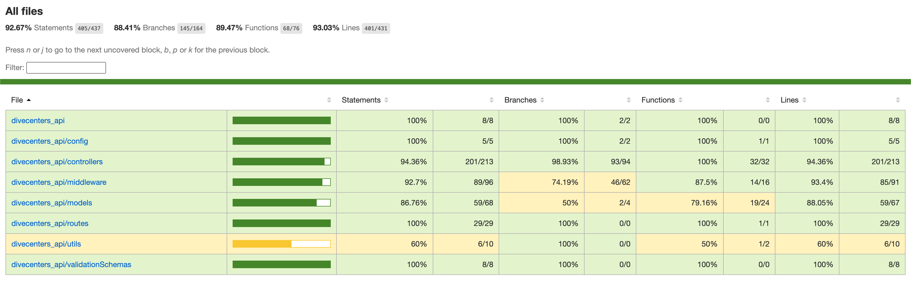

# DiveCenters API

> Open Backend API for Diving applications, which is intended for developers to build front end apps to show and create a directory of Diving centers with información of their courses and reviews. It is necesary for certain operations to register a user and to have a role allowed for that operation.

## API Documentation
https://www.divecenters.xyz/


## Install Dependencies
```
npm install
```

## Configuration
Duplicate file "config.env" to ".env" and update the values/settings to your own

## Run application
```
# Run in dev mode
npm run dev

# Run in production mode
npm start
```

## Run Tests
Almost all code is covered by tests, to run them, execute:
```
npm run test
```
Coverage testing is activated in `package.json` (flag <i>--coverage</i> in test script).

So, when running the tests, an HTML file in <i>coverage/lcov-report/index.html</i> will be generated with the information of tests, as shown in the following image



## Version & License
- Version: 1.0.0
- License: MIT

## Contact information
Daniel Ruiz <<druizcallado@gmail.com>>